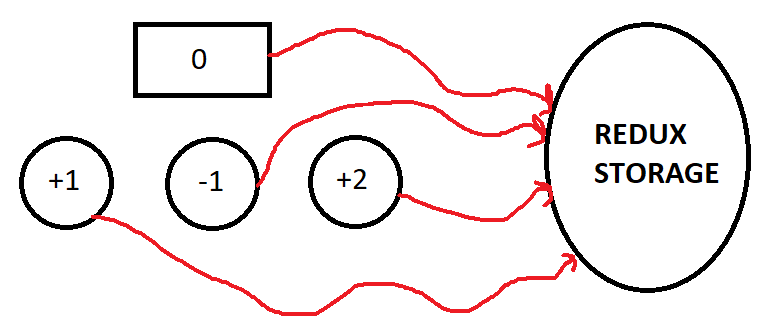

# reduxIntroCounter_Sayac

Bu uygulamada Redux' a giriş yapılarak bir sayaç geliştirilecektir.

Sayacın 3 butonu olacaktır: +1, -1, +2 şeklinde sayıyı değiştirmesi sağlanacaktır.
3 buton ve mevcut sayıyı gösterecek componentle beraber toplam 4 componentten oluşacaktır ve dışarıda bir Redux için Redux storage tutulacaktır.
Bu componentlerin hepsi Redux storage' a bağlanacaktır. 

Önce yeni bir proje oluşurulur ve Terminal' den redux indirme: npm install redux; react için redux: npm install react-redux komutları yazılır.

*Magic String' ten kurtulmak için actionTypes.js oluşturuldu. İçine birden fazla yerde kullanılacak olan variablelar const olarak tutulmuştur.

*Redux ile ilk iletişimi kurduğumuz nokta: actionlardır. Bu yüzden counterAction.js oluşturuldu.

Action: componentimizden çağırdığımız aksiyondur.
Bu action, Reducer yapısı ile kontrol altına alınmaktadır. Reducer, ilgili action' ı içerip içermediğine bakmaktadır.

Bu Reducer , aksiyona göre state belirlemektedir., state' mizi kontrol ettiğimiz yer
Componentler sadece reducer içindeki stateden yararlanacaktır. Reducerdaki state' e göre artırıp , azaltma işlemi uygulanacaktır.
Önce kopya alıp, ref oluşturup onun üzerinde işlem yapılacaktır. Referans üzerinden işlem yapmak gerekir.

"reducers" folderının içinde genelde index.js dosyası bulunur ve Reducerları bir araya getirir.
Redux->  reducerlarına gidiyo bakıyor ve ilgili action'ı kullanan biri var mı diye bakıyor.

store-> bu yapının tamamını içeren yapı
